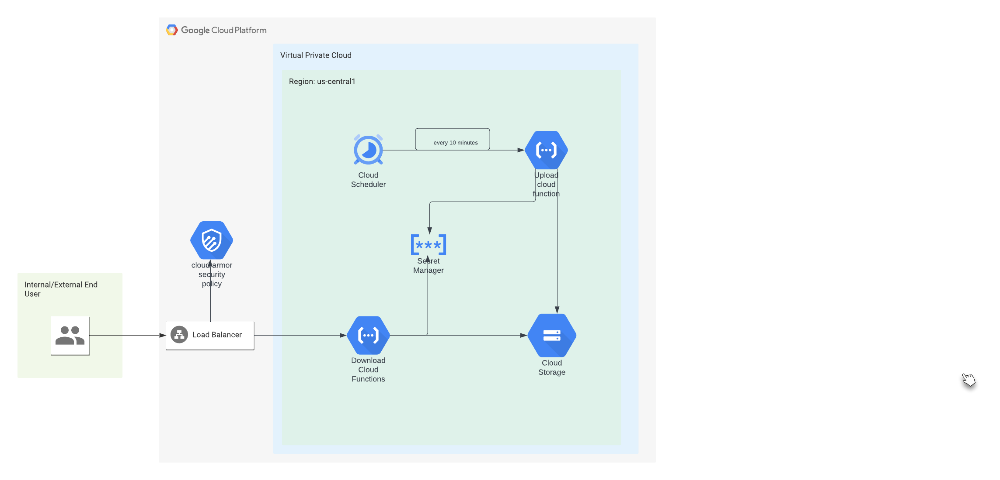

## KMS Ecrypted files upload and download using cloud functions.

This is a system that leverages cloud functions to upload and download KMS encrypted files. The files are encrypted and uploaded using a cloud scheduler and cloud function. Then they'll be downloaded by another cloud function. 
The system has multiple components to enable the functionalities. The architecture is as follows. 




The folder structure is as follows.
1. main.tf - contains tf code to enable apis required by the system. These include the following 
   - "cloudfunctions.googleapis.com"
   - "artifactregistry.googleapis.com"
   - "cloudbuild.googleapis.com"
   - "cloudkms.googleapis.com"
   - "run.googleapis.com"
   - "cloudscheduler.googleapis.com"  
2. bucket.tf - contains tf code to provision buckets to house code and files.
3. kms.tf - contains tf code to provision CMEK KMS key chain and key. 
4. upload-function.tf - contains tf code to provision upload function and it's scheduler
5. download-function.tf - contains tf code to provision download function, security policy to rate limit, and loadbalacer and NEG to front it. 
6. iam.tf - contains tf code to provision service accounts used by cloud functions and scheduler. 
7. Scripts - folder that contains the python cloud functions scripts for upload and download. 

### Provisioning.
To provision the infrastructure, take the following steps. 

1. Create a `terraform.tfvars` file and add the following lines.
    `project = <project-id> `# project id of where the infrastructure will be provisioned.
2. `terraform init`
3. `terraform plan`
4. `terraform apply --var-file=terraform.tfvars --auto-approve`. 
5. Once the apply is successful, it will output an IP address, please save that as you'll need it to access the download function. 

### Upload function
The system utilizes cloud functions to implement the upload functionality. The cloud function gets triggered by a scheduler that runs every 10 minutes. the upload function can only be called by the scheduler as the scheduler only has invoker access to the function. The upload function also has set it's ingress settings to internal. This prevents any actor outside of the project from invoking the function. 

The app, when invoked will generate a random string, encrypt it using the KMS key provided and upload it to the `encrypted-files-bucket-<random-string>` bucket. The bucket name and kms key name are provided through environment variables. 

### Download function

The system utilizes cloud functions to implement the download functionality. The cloud function is part of a Serverless Named Entity Group(NEG), which is then the backend for an application load balancer. The application load balancer is provsioned by an excellent module("GoogleCloudPlatform/lb-http/google"). The module takes care of all the necessary steps to provion a load balancer. It creates an external reserved IP, a global forwarding rule, a compute target http proxy, a url map, a backend service and also a health check. There's a cloud armor security policy created to rate limit more than 210 requests in 10 minutes per IP. If one IP creates more than 210 requests within 10 minutes, it will get 429 too many requests error. 

The app will list all the objects in the `encrypted-files-bucket` and sort them by their date. It will then return the most recent one to the client. To access the download function, use the IP you saved above as follows.
` curl 34.111.205.126 #<IP from above>`. You'll see a message like the following.
`This is an encrypted data with random id = 1WGVQDTQ7SXVQEDXKP17AAQRSU2ML3 uploaded at 1708921201.0341556%` 

### Testing rate limit.
To test the rate limit functionality, you have to hit the above IP more than 210 times with in 10 minutes. We'll use the following bash script for that.
```
for i in $(seq 1 211); do
    curl 34.111.205.126  #<IP from above>
done
```
After the 210 requests, the 211th request will return with 429 too many requests error. 

```
Author: Enkusellasie Wendwosen Feleke
email: enkusellasie.feleke@gmail.com
```
